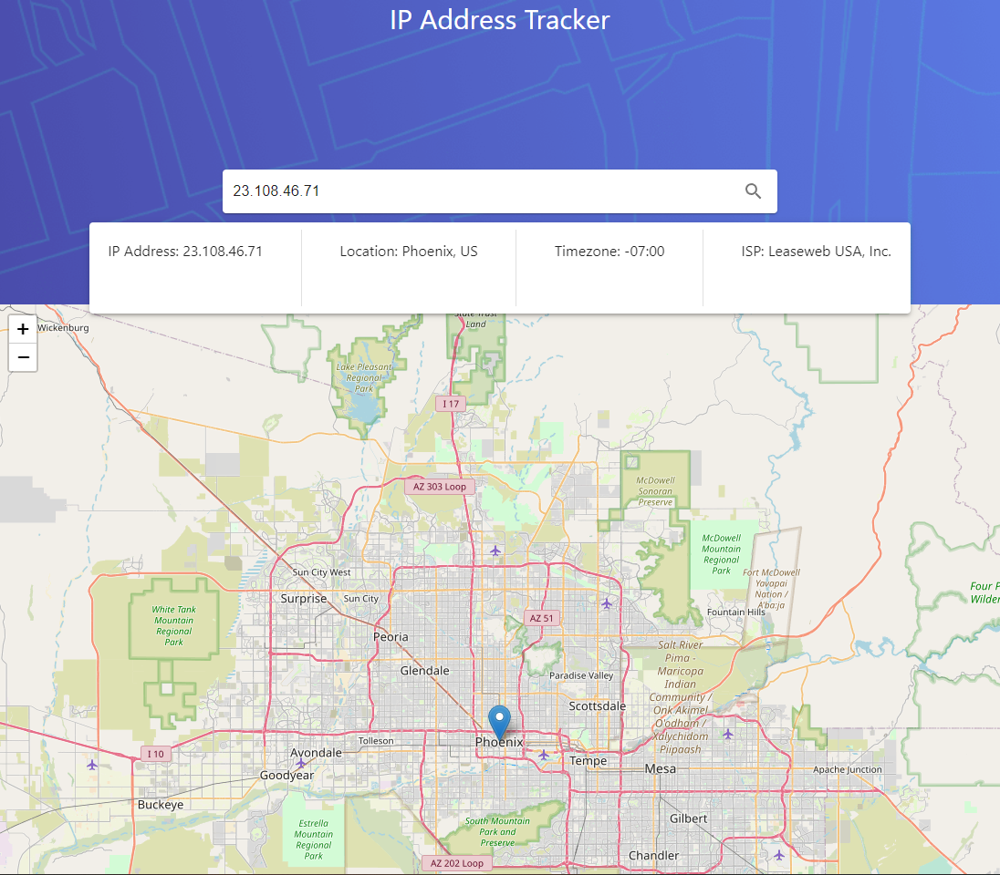

# IP Address Tracker

The IP Address Tracker is a web application that enables users to input an IP address or domain and retrieve key information about it, including its geographical location. This data is visually presented with the help of an interactive map.

## Table of Contents

- [Overview](#overview)
- [Screenshot](#screenshot)
- [Demo](#demo)
- [Technologies Used](#technologies-used)
- [Features](#features)
- [Setup](#setup)
- [Future Updates](#future-updates)
- [Author](#author)

## Overview

The application provides an intuitive user interface for tracking the location of IP addresses or domains. It's designed with a responsive layout to adapt to different screen sizes.

### Screenshot



### Demo

- Live Site URL: [Add live site URL here](https://iptracker-i7g5.vercel.app/)

## Technologies Used

- HTML5
- CSS
- JavaScript
- React.js
- Axios
- Leaflet (For interactive maps)

## Features

Users can:

- See their own IP address on the map on the initial page load
- Search for any IP addresses or domains and see key information and location
- View the optimal layout for each page depending on their device's screen size
- Experience interactive elements with distinct hover states

## Setup

To run this project, install it locally using npm:

```bash
  $ git clone https://github.com/user/repository
  $ cd repository
  $ npm install
  $ npm start
